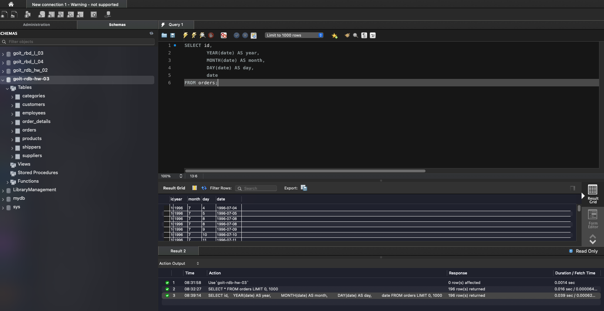
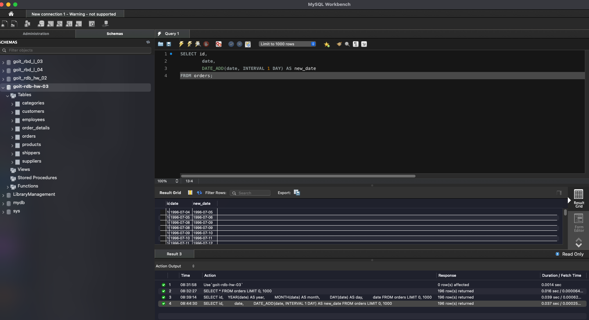
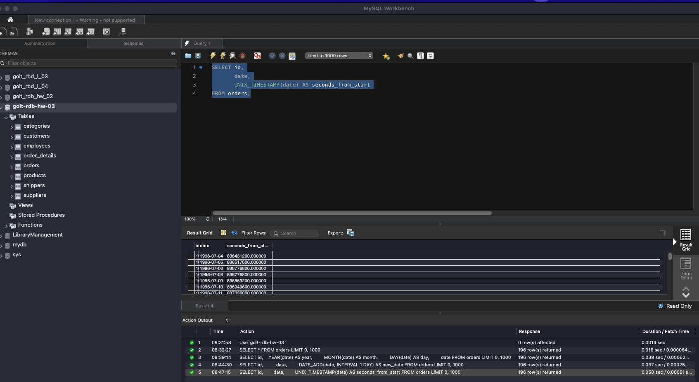
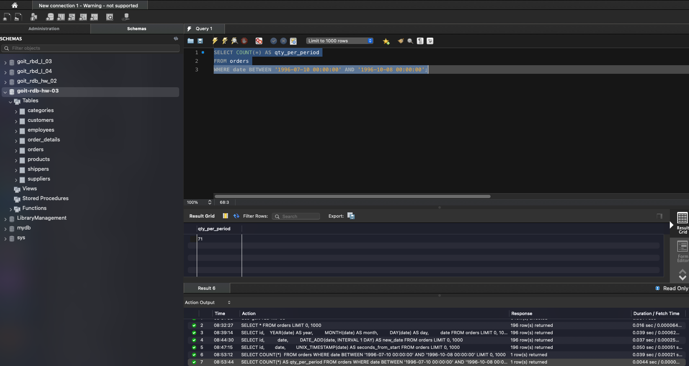
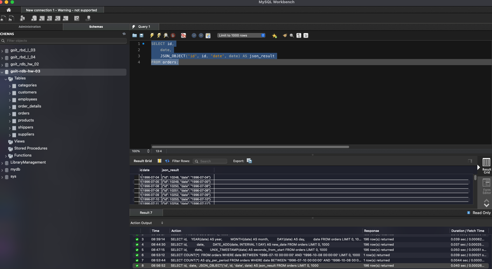

# 1 Напишіть SQL-запит, який для таблиці orders з атрибута date витягує рік, місяць і число”;

# 2 Напишіть SQL-запит, який для таблиці orders до атрибута date додає один день.;

# 3 Напишіть SQL-запит, який для таблиці orders для атрибута date відображає кількість секунд з початку відліку;

# 4 Напишіть SQL-запит, який рахує, скільки таблиця orders містить рядків з атрибутом date у межах між 1996-07-10 00:00:00 та 1996-10-08 00:00:00;

# 5 Напишіть SQL-запит, який для таблиці orders виводить на екран атрибут id, атрибут date та JSON-об’єкт;

